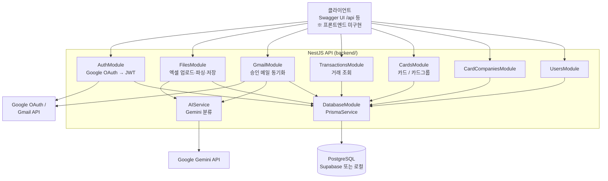
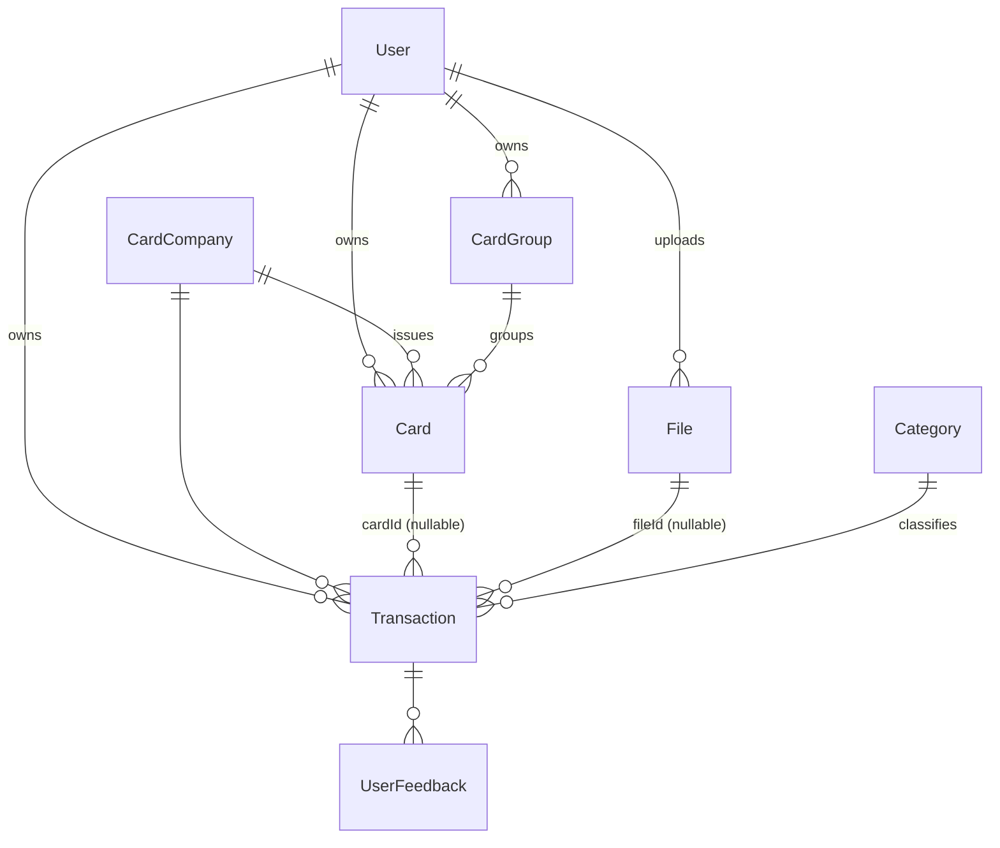
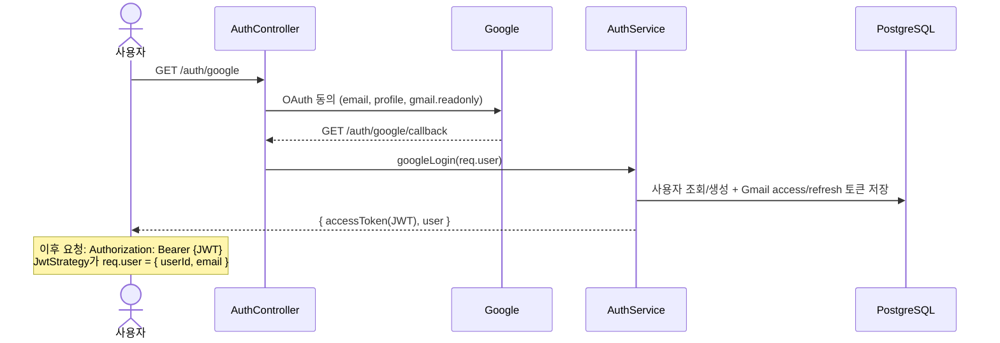
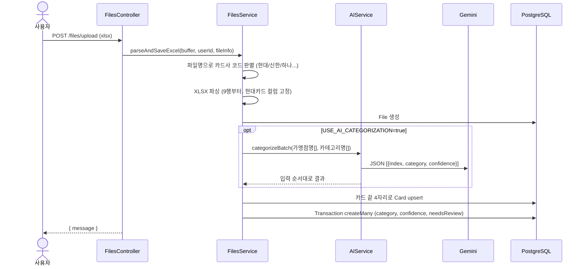
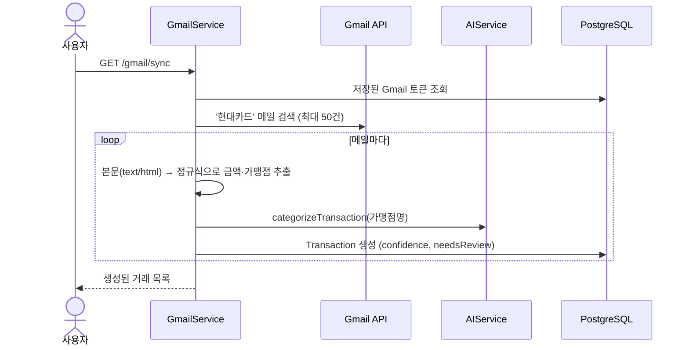

# 현재 구현 아키텍처 (As-Built)

> **이 문서가 기준 문서입니다.** `backend/src` 실제 코드 기준으로 작성했습니다.
> [시스템 아키텍처 v1](./system-architecture.md) / [v2](./system-architecture-v2.md)는 초기 설계안이며, 구현과 다른 부분이 많습니다 (아래 [설계안과 차이](#설계안과-차이) 참고).
>
> 마지막 갱신: 2026-10-07

---

## 전체 구성



| 구분 | 사용 기술 |
|---|---|
| 서버 | NestJS, 전역 `ValidationPipe`(whitelist, transform), Swagger(`/api`) |
| DB | PostgreSQL + Prisma (`@prisma/adapter-pg`), `DB_SSL`로 Supabase/로컬 전환 |
| 인증 | Google OAuth(passport-google, `gmail.readonly` scope) → 자체 JWT (기본 7일) |
| AI | Google Gemini `gemini-3-flash-preview` (`@google/genai`) |
| 파싱 | `xlsx`(엑셀), `cheerio`(메일 HTML) |
| 배포 설정 | `backend/railway.toml`, `backend/Procfile` |
| 프론트엔드 | 없음 |

---

## 모듈 구조

```
backend/src/
├── main.ts                     # CORS, ValidationPipe, Swagger(/api)
├── app.module.ts               # 아래 모듈 전부 import, ConfigModule(global)
├── database/                   # PrismaService (모든 모듈이 사용)
├── auth/                       # Google OAuth 콜백 → 사용자 upsert + Gmail 토큰 저장 + JWT 발급
│   ├── guards/jwt-auth.guard.ts
│   └── strategies/             # google.strategy.ts, jwt.strategy.ts
├── users/                      # 사용자 CRUD
├── card-companies/             # 카드사 마스터 CRUD
├── cards/                      # 카드(끝 4자리) / 카드그룹 CRUD (컨트롤러 2개)
├── files/                      # 엑셀 업로드 + 재분류 + AIService
│   ├── files.service.ts        # 파싱·카드 매칭·저장을 한 서비스에서 처리
│   └── ai.service.ts           # Gemini 호출 (GmailModule도 사용)
├── gmail/                      # Gmail 승인 메일 → 거래 저장
└── transactions/               # 거래 조회 (GET만)
```

모듈 의존: 모든 모듈 → `DatabaseModule`, `GmailModule` → `FilesModule`(AIService 재사용).

---

## 데이터 모델 (`backend/prisma/schema.prisma`)



- `Card`는 `(userId, cardCompanyId, last4)` 유니크. 업로드 시 처음 보는 카드는 그룹 없이 자동 등록됩니다.
- `Transaction.confidence`(0.00~1.00) / `needsReview`: AI 분류 신뢰도. 0.80 미만이면 `needsReview = true`.
- `UserFeedback`: 테이블만 있고 코드에서 사용하지 않습니다.

---

## API 엔드포인트

`/auth/*`, `/users/*` 외에는 모두 `JwtAuthGuard`(Bearer 토큰) 적용.

| 메서드 | 경로 | 설명 |
|---|---|---|
| GET | `/auth/google` | Google 로그인 시작 |
| GET | `/auth/google/callback` | 콜백 → `{ accessToken, user }` |
| POST/GET/GET/PATCH/DELETE | `/users`, `/users/:id` | 사용자 CRUD (**가드 없음**) |
| POST/GET/GET/PATCH/DELETE | `/card-companies`, `/card-companies/:id` | 카드사 CRUD |
| POST/GET/PATCH/DELETE | `/cards`, `/cards/:id` | 내 카드 CRUD |
| POST/GET/PATCH/DELETE | `/card-groups`, `/card-groups/:id` | 카드그룹 CRUD |
| POST | `/files/upload` | 엑셀 업로드 (`file`, xlsx/xls) |
| PUT | `/files/transactions/:id/recategorize` | 거래 1건 Gemini 재분류 |
| GET | `/gmail/sync` | Gmail 승인 메일 동기화 |
| GET | `/transactions?groupId&cardId&from&to` | 거래 조회 (페이지네이션 없음) |

---

## 핵심 플로우

### 1. 로그인



### 2. 엑셀 업로드 (핵심 기능)



- 카드사 판별은 **파일명** 기준입니다. 엑셀 컬럼 매핑은 현대카드 형식 하나로 고정되어 있어, 다른 카드사 엑셀은 사실상 지원하지 않습니다.
- AI 결과가 없거나 카테고리 목록에 없으면 첫 번째 활성 카테고리로 저장하고 `needsReview = true`로 둡니다.

### 3. Gmail 동기화



- 검색 쿼리는 현대카드로 고정이고, 이미 저장한 메일인지 확인하지 않습니다(재실행 시 중복 저장).

### 4. 재분류

`PUT /files/transactions/:id/recategorize` → `AIService.categorizeTransaction` → 카테고리와 함께 `confidence`, `needsReview`를 갱신합니다.

---

## 설계안과 차이

| 항목 | 설계안 (v2 / ADR) | 현재 구현 |
|---|---|---|
| AI | OpenAI → AWS Bedrock (ADR-004) | Gemini ([ADR-007](./architecture-decisions.md#adr-007-ai-서비스-변경-gemini)) |
| 인증 | 이메일/비밀번호 회원가입·로그인 | Google OAuth만 |
| 파서 | Parser Service + 카드사별 파서 + Factory | `FilesService` 내부 메서드, 현대카드 형식만 |
| 저장 경로 | AI Service → Transactions Service | `FilesService` / `GmailService`가 직접 Prisma 저장 |
| 파일 저장 | Supabase Storage | 원본 파일 저장 안 함 (`File.fileUrl`에 생성한 파일명만 기록) |
| Transactions | CRUD + 배치 | 조회만 |
| Categories / Statistics 모듈 | 있음 | 없음 (카테고리는 `seed_categories.sql`) |
| Feedback Service | 수정 이력 학습 | 없음 (`UserFeedback` 테이블만) |
| 공통 필터·인터셉터 (`common/`) | 있음 | 없음 |
| Frontend | Next.js (Vercel) | 없음 |
| Gmail 연동 | Phase 2 계획 | 구현됨 (현대카드 한정) |
| 카드 / 카드그룹 | 설계에 없음 | 구현됨 |

---

## 알려진 한계

- `/users` 엔드포인트에 인증 가드가 없습니다.
- `needsReview` 거래만 골라 조회하는 API가 없습니다.
- `/transactions` 조회에 페이지네이션이 없습니다.
- Gmail 동기화를 다시 실행하면 같은 메일의 거래가 중복 저장됩니다.
- 하나카드 HTML 명세서(`samples/hana/`)는 분석만 했고 파서는 없습니다.
