# 시스템 아키텍처 및 플로우 (NestJS Backend 포함)

## 전체 시스템 아키텍처

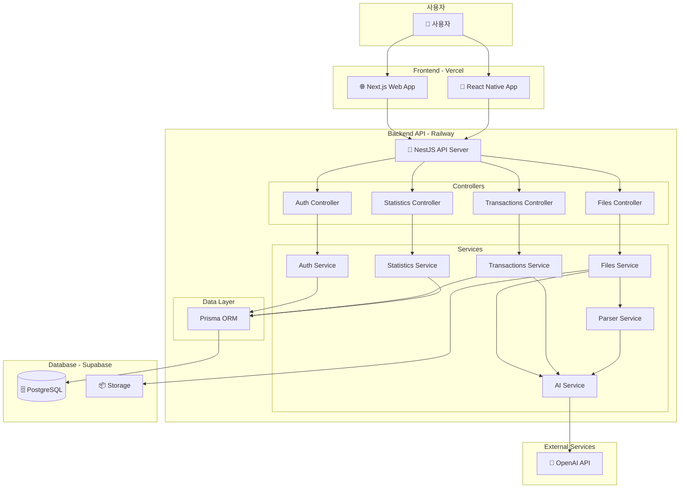

---

## NestJS Backend 구조 상세

### 모듈 구조

```
backend/
├── src/
│   ├── main.ts                    # 애플리케이션 진입점
│   ├── app.module.ts              # 루트 모듈
│   │
│   ├── auth/                      # 인증 모듈
│   │   ├── auth.module.ts
│   │   ├── auth.controller.ts     # POST /auth/register, /auth/login
│   │   ├── auth.service.ts        # JWT 생성, 비밀번호 해싱
│   │   ├── guards/
│   │   │   └── jwt-auth.guard.ts  # JWT 검증 가드
│   │   └── strategies/
│   │       └── jwt.strategy.ts    # Passport JWT 전략
│   │
│   ├── users/                     # 사용자 모듈
│   │   ├── users.module.ts
│   │   ├── users.controller.ts
│   │   ├── users.service.ts
│   │   └── dto/
│   │       ├── create-user.dto.ts
│   │       └── update-user.dto.ts
│   │
│   ├── files/                     # 파일 업로드 모듈
│   │   ├── files.module.ts
│   │   ├── files.controller.ts    # POST /files/upload
│   │   ├── files.service.ts       # 파일 저장, 파싱 조율
│   │   ├── parsers/               # 카드사별 파서
│   │   │   ├── base.parser.ts     # 추상 파서 클래스
│   │   │   ├── shinhan.parser.ts  # 신한카드 파서
│   │   │   ├── samsung.parser.ts  # 삼성카드 파서
│   │   │   ├── hyundai.parser.ts  # 현대카드 파서
│   │   │   ├── kb.parser.ts       # KB국민카드 파서
│   │   │   └── parser.factory.ts  # 파서 팩토리
│   │   └── dto/
│   │       └── upload-file.dto.ts
│   │
│   ├── ai/                        # AI 분류 모듈
│   │   ├── ai.module.ts
│   │   ├── ai.service.ts          # OpenAI API 호출
│   │   ├── prompts/
│   │   │   └── category-prompt.ts # 프롬프트 템플릿
│   │   └── dto/
│   │       └── classify-transaction.dto.ts
│   │
│   ├── transactions/              # 거래 내역 모듈
│   │   ├── transactions.module.ts
│   │   ├── transactions.controller.ts
│   │   ├── transactions.service.ts
│   │   └── dto/
│   │       ├── create-transaction.dto.ts
│   │       ├── update-transaction.dto.ts
│   │       └── query-transaction.dto.ts
│   │
│   ├── categories/                # 카테고리 모듈
│   │   ├── categories.module.ts
│   │   ├── categories.controller.ts
│   │   ├── categories.service.ts
│   │   └── dto/
│   │       └── create-category.dto.ts
│   │
│   ├── statistics/                # 통계 모듈
│   │   ├── statistics.module.ts
│   │   ├── statistics.controller.ts
│   │   ├── statistics.service.ts  # 집계 쿼리
│   │   └── dto/
│   │       └── statistics-query.dto.ts
│   │
│   ├── database/                  # 데이터베이스 모듈
│   │   ├── database.module.ts
│   │   └── prisma.service.ts      # Prisma 클라이언트
│   │
│   └── common/                    # 공통 모듈
│       ├── filters/
│       │   └── http-exception.filter.ts
│       ├── interceptors/
│       │   └── logging.interceptor.ts
│       └── decorators/
│           └── current-user.decorator.ts
│
├── prisma/
│   ├── schema.prisma              # DB 스키마
│   └── migrations/                # 마이그레이션 파일
│
├── test/
├── .env
├── .env.example
├── package.json
├── tsconfig.json
└── nest-cli.json
```

---

## 핵심 기능별 플로우

### 1. 사용자 인증 플로우

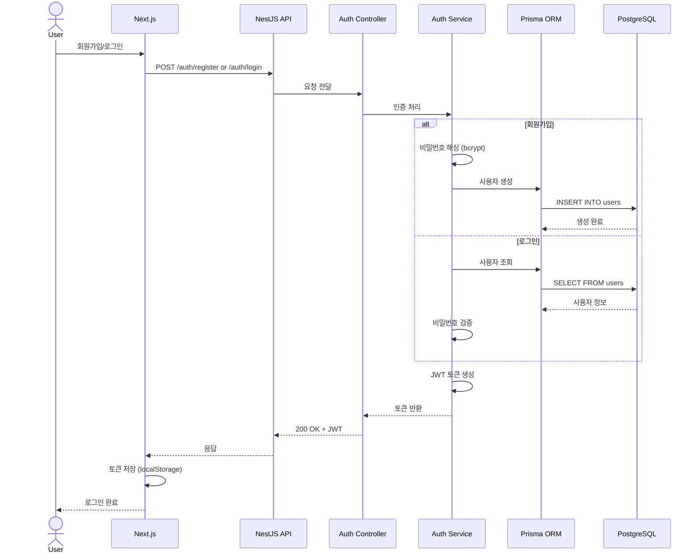

---

### 2. 엑셀 파일 업로드 및 분류 플로우

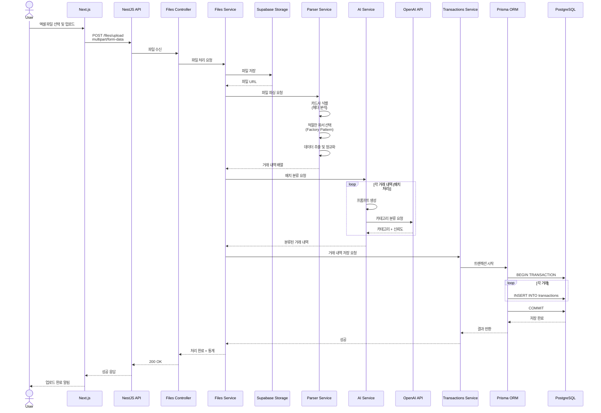

---

### 3. 거래 내역 조회 및 통계 플로우

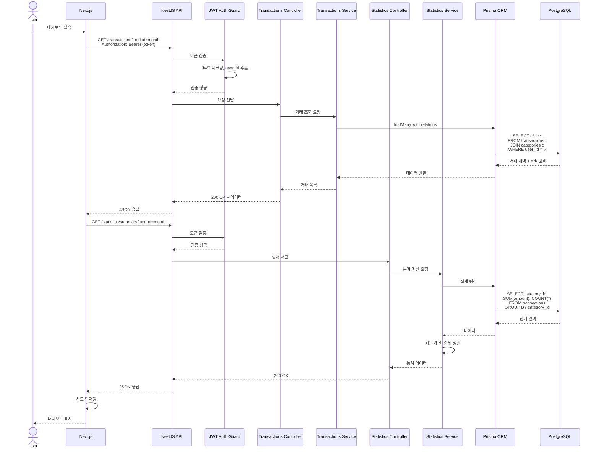

---

### 4. 카테고리 수정 및 학습 플로우

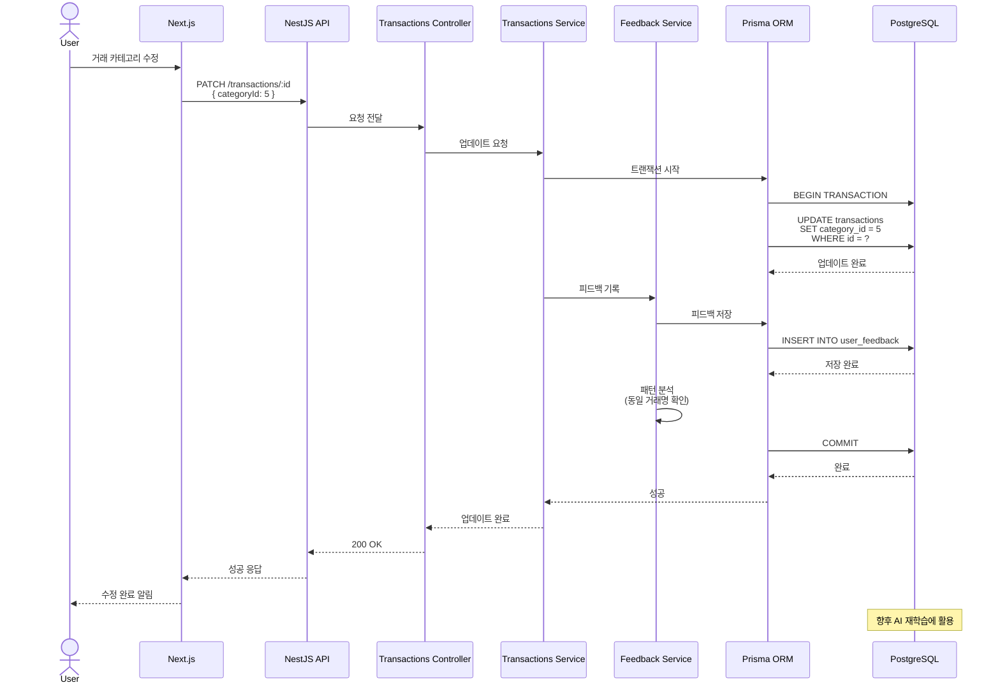

---

## AI 분류 프로세스 상세

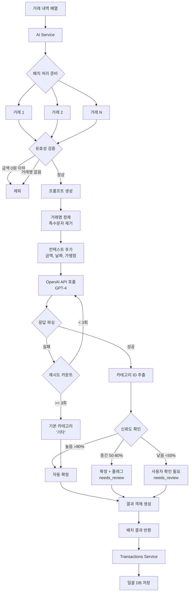

---

## 데이터 흐름도

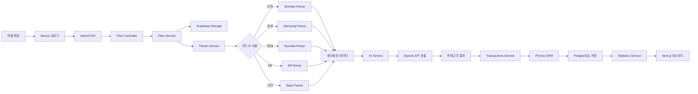

---

## 보안 플로우

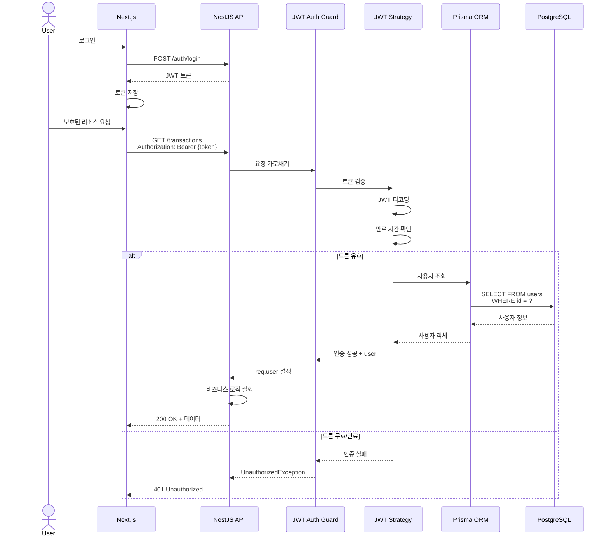

---

## 에러 처리 플로우

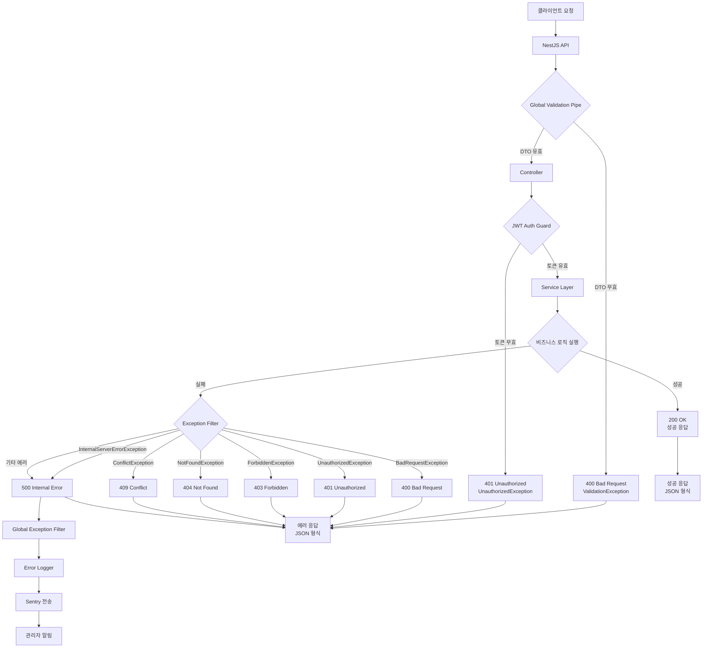

---

## 배포 아키텍처

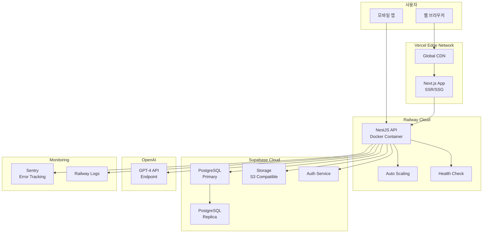

---

## 성능 최적화 전략

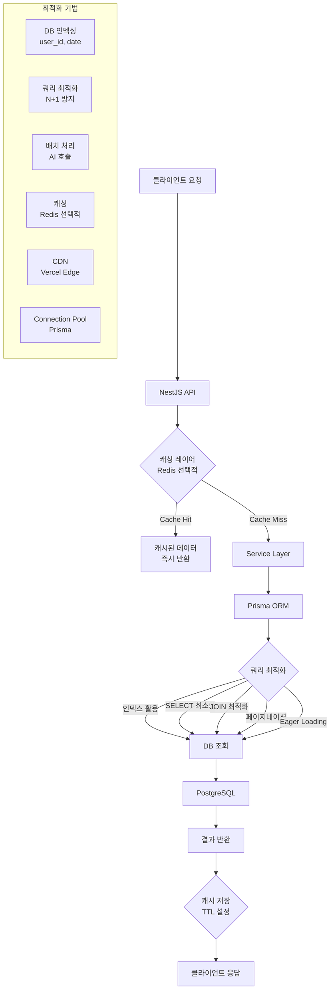

---

## API 엔드포인트 설계

### 인증 (Auth)
```
POST   /auth/register          # 회원가입
POST   /auth/login             # 로그인
POST   /auth/refresh           # 토큰 갱신
GET    /auth/me                # 현재 사용자 정보
```

### 파일 (Files)
```
POST   /files/upload           # 엑셀 파일 업로드
GET    /files                  # 업로드 파일 목록
GET    /files/:id              # 파일 상세
DELETE /files/:id              # 파일 삭제
```

### 거래 내역 (Transactions)
```
GET    /transactions           # 거래 목록 조회
GET    /transactions/:id       # 거래 상세
POST   /transactions           # 거래 생성 (수동)
PATCH  /transactions/:id       # 거래 수정
DELETE /transactions/:id       # 거래 삭제
POST   /transactions/batch     # 일괄 생성
```

### 카테고리 (Categories)
```
GET    /categories             # 카테고리 목록
GET    /categories/:id         # 카테고리 상세
POST   /categories             # 카테고리 생성
PATCH  /categories/:id         # 카테고리 수정
DELETE /categories/:id         # 카테고리 삭제
```

### 통계 (Statistics)
```
GET    /statistics/summary     # 요약 통계
GET    /statistics/by-category # 카테고리별 통계
GET    /statistics/by-month    # 월별 통계
GET    /statistics/trends      # 트렌드 분석
```

---

## 향후 확장 계획

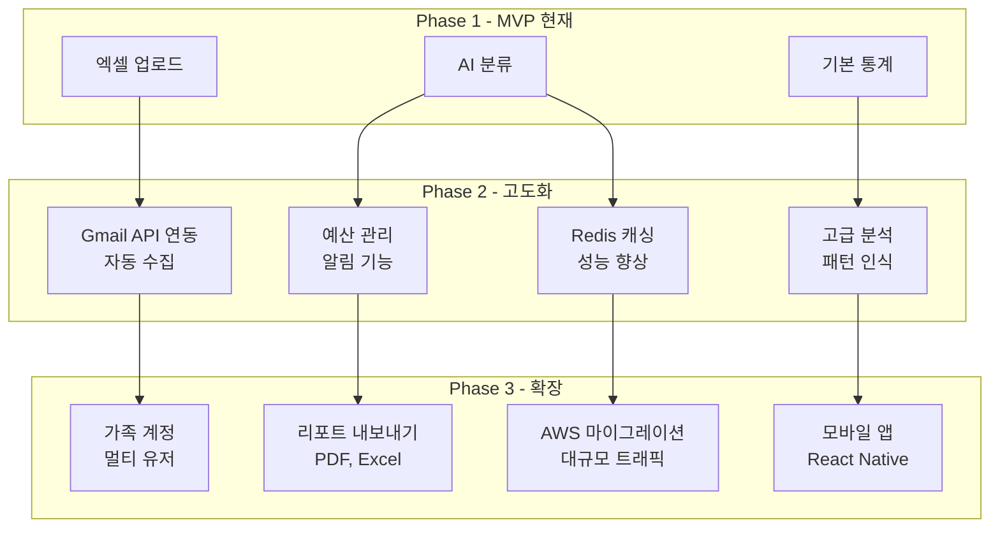

---

## 개발 우선순위

### 1단계: 핵심 Backend API (2주)
- [ ] NestJS 프로젝트 초기화
- [ ] Prisma 스키마 작성
- [ ] Auth 모듈 (JWT)
- [ ] Users 모듈
- [ ] Categories 모듈 (시드 데이터)

### 2단계: 파일 처리 (1-2주)
- [ ] Files 모듈
- [ ] 카드사별 파서 구현
- [ ] Parser Factory 패턴

### 3단계: AI 분류 (1주)
- [ ] AI 모듈
- [ ] OpenAI API 연동
- [ ] 프롬프트 최적화

### 4단계: 거래 관리 (1주)
- [ ] Transactions 모듈
- [ ] CRUD API
- [ ] 배치 처리

### 5단계: 통계 (1주)
- [ ] Statistics 모듈
- [ ] 집계 쿼리 최적화
- [ ] 캐싱 전략

### 6단계: 배포 (3-5일)
- [ ] Railway 설정
- [ ] 환경 변수 관리
- [ ] CI/CD 파이프라인
- [ ] 모니터링 설정
