# 시스템 아키텍처 및 플로우

## 전체 시스템 아키텍처

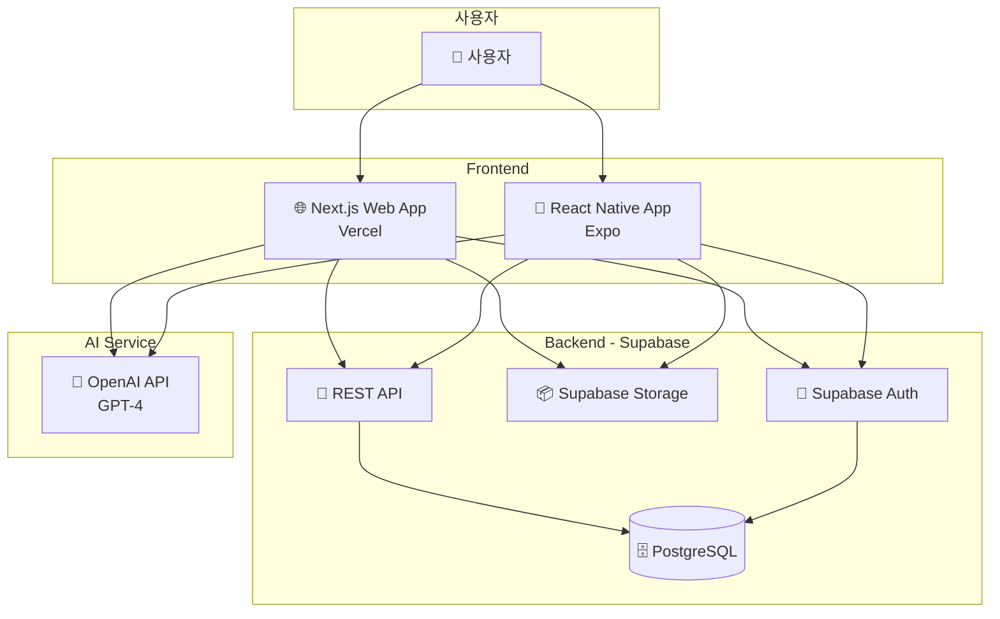

---

## 핵심 기능별 플로우

### 1. 사용자 인증 플로우

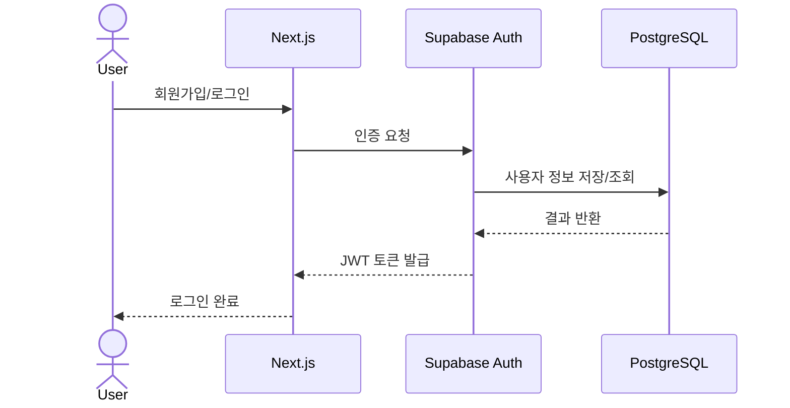

---

### 2. 엑셀 파일 업로드 및 분류 플로우

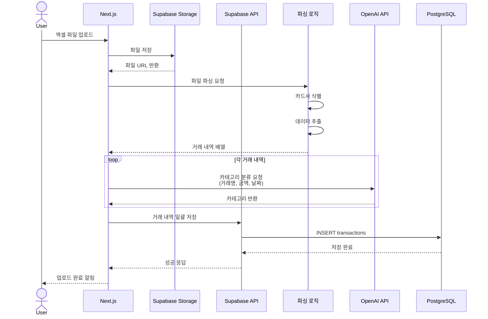

---

### 3. 거래 내역 조회 및 통계 플로우

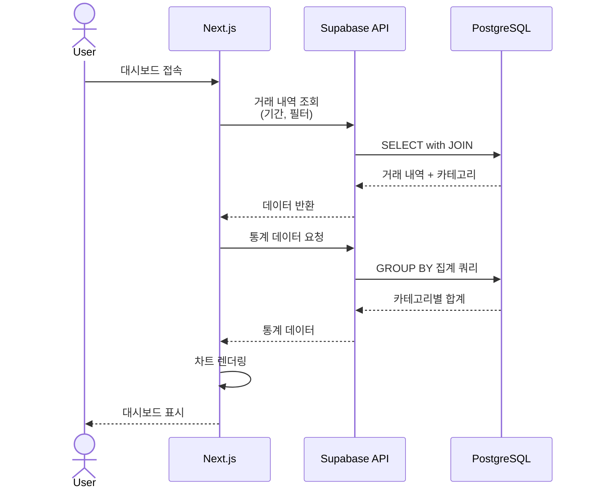

---

### 4. 카테고리 수정 및 학습 플로우

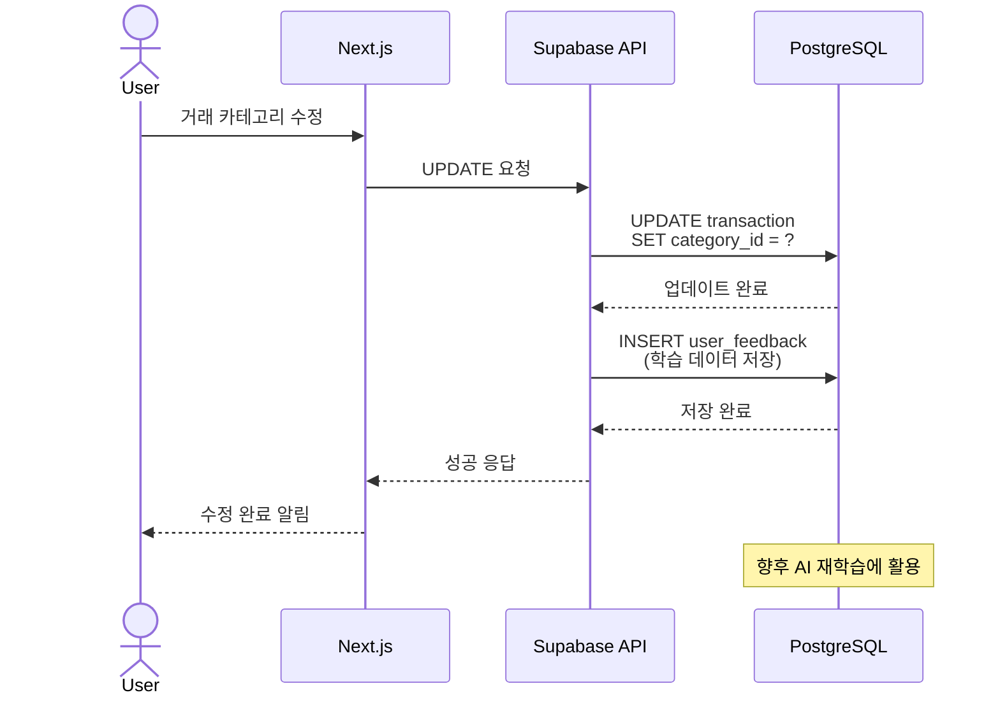

---

## 데이터 흐름도

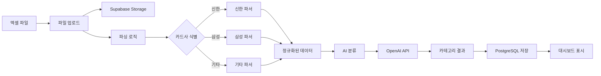

---

## 시스템 컴포넌트 구조

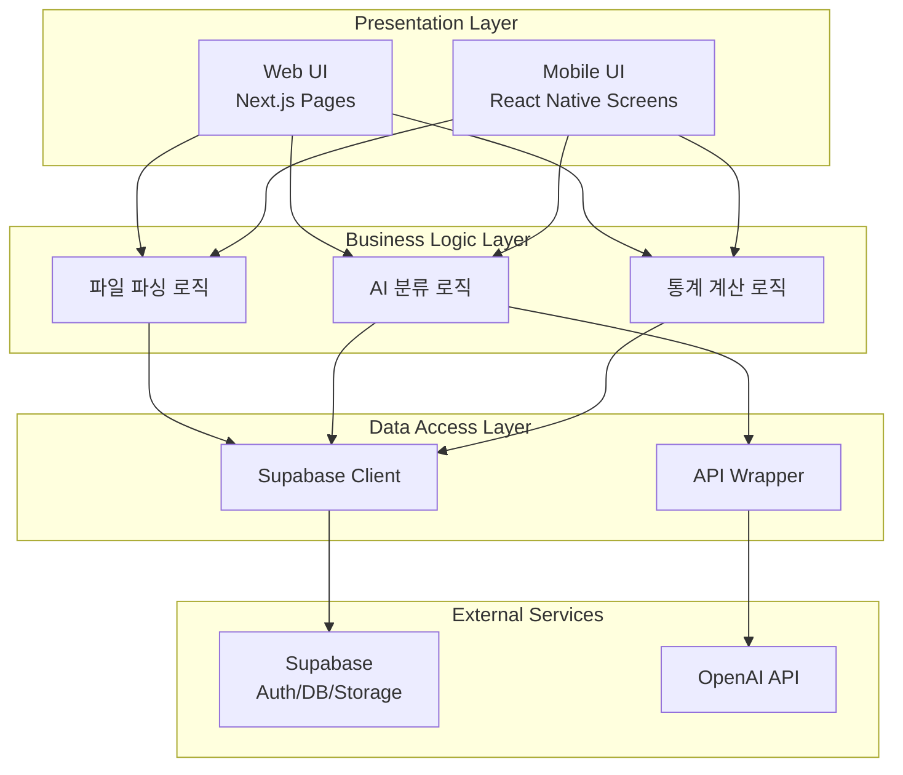

---

## 배포 아키텍처

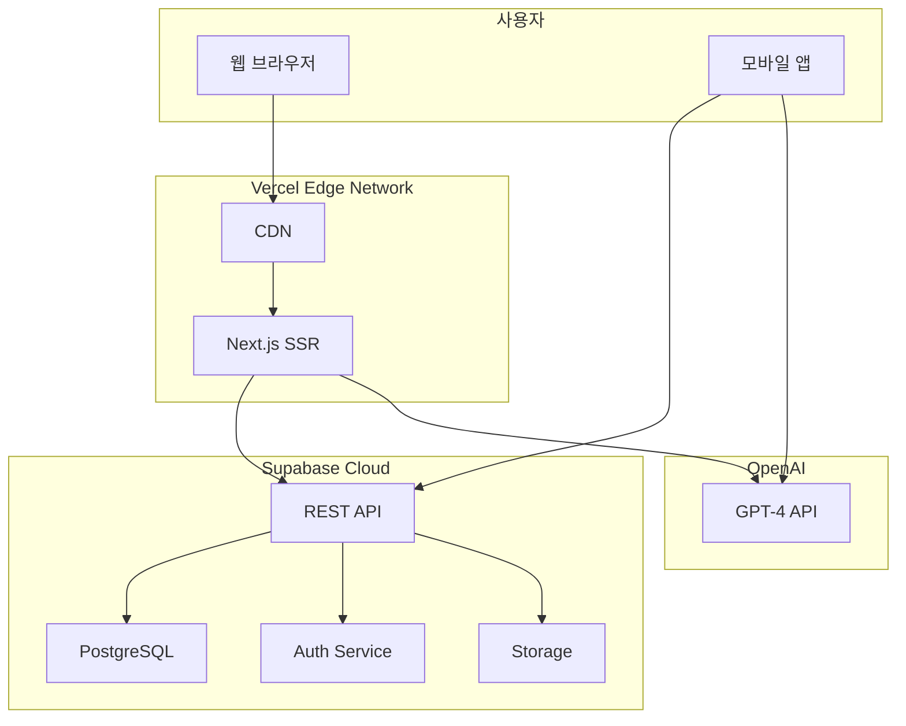

---

## AI 분류 프로세스 상세

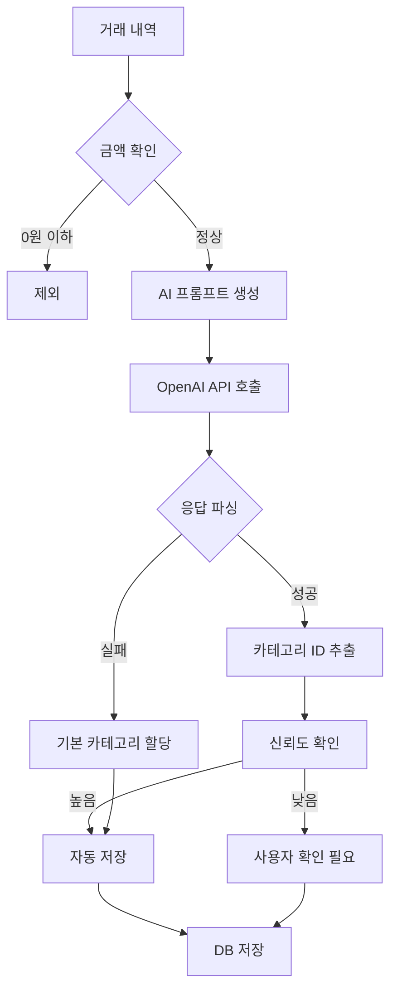

---

## 에러 처리 플로우

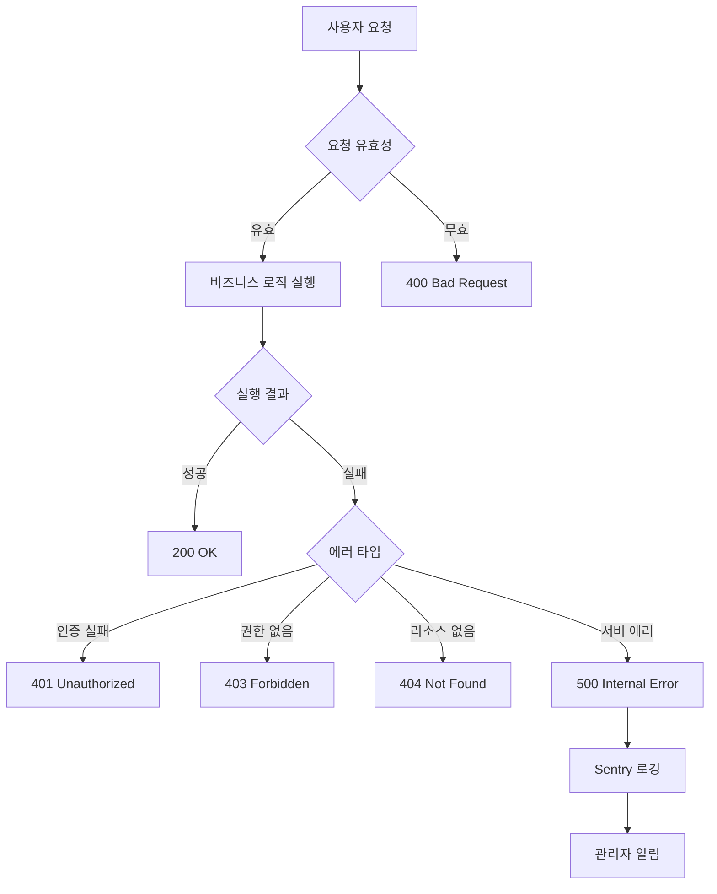

---

## 보안 플로우

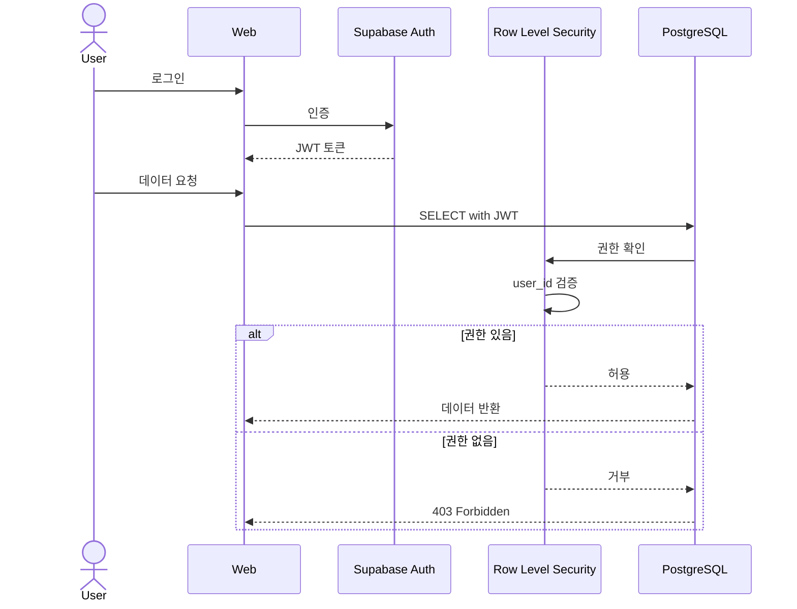

---

## 성능 최적화 전략

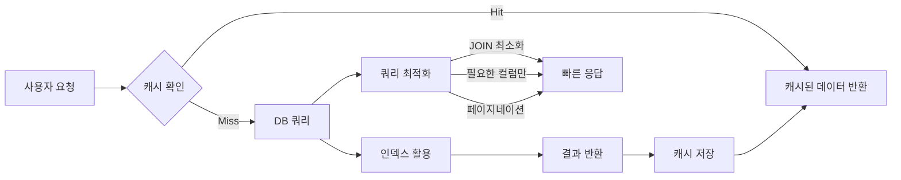

---

## 향후 확장 계획

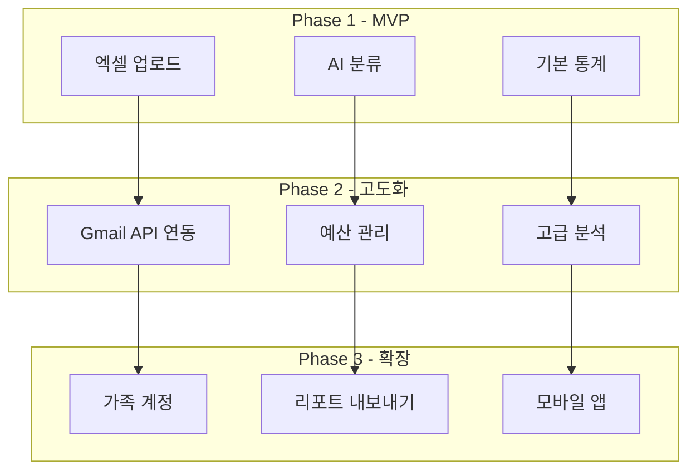
