# 시스템 아키텍처 및 플로우

> ⚠️ **폐기된 초기 설계안 (Supabase BaaS 구조)** — NestJS 백엔드 도입으로 [v2](./system-architecture-v2.md)로 대체되었고, v2 역시 설계안입니다.
> 현재 구현은 [현재 구현 아키텍처](./current-architecture.md)를 참고하세요.

## 전체 시스템 아키텍처

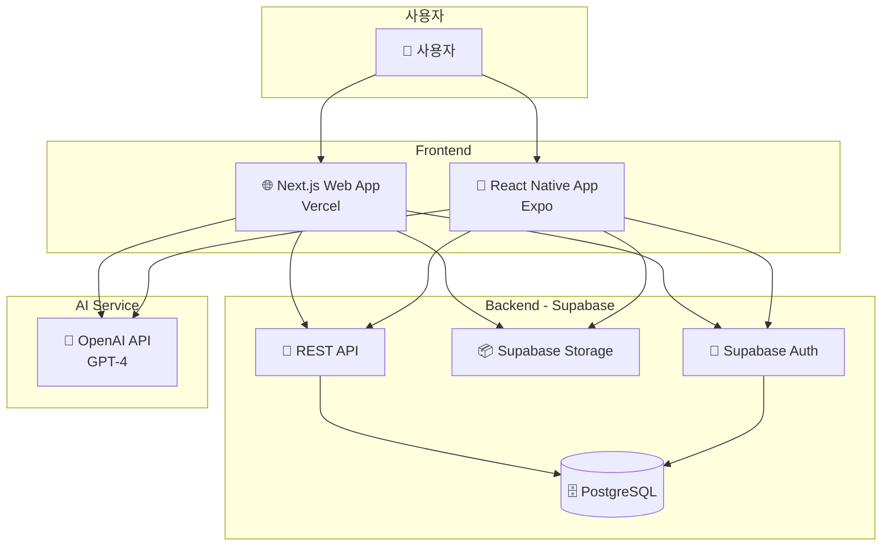
```mermaid
graph TB
    subgraph "사용자"
        User[👤 사용자]
    end

    subgraph "Frontend"
        Web[🌐 Next.js Web App<br/>Vercel]
        Mobile[📱 React Native App<br/>Expo]
    end

    subgraph "Backend - Supabase"
        Auth[🔐 Supabase Auth]
        DB[(🗄️ PostgreSQL)]
        Storage[📦 Supabase Storage]
        API[🔌 REST API]
    end

    subgraph "AI Service"
        OpenAI[🤖 OpenAI API<br/>GPT-4]
    end

    User --> Web
    User --> Mobile
    
    Web --> Auth
    Web --> API
    Web --> Storage
    Mobile --> Auth
    Mobile --> API
    Mobile --> Storage
    
    API --> DB
    Auth --> DB
    
    Web --> OpenAI
    Mobile --> OpenAI
```

---

## 핵심 기능별 플로우

### 1. 사용자 인증 플로우

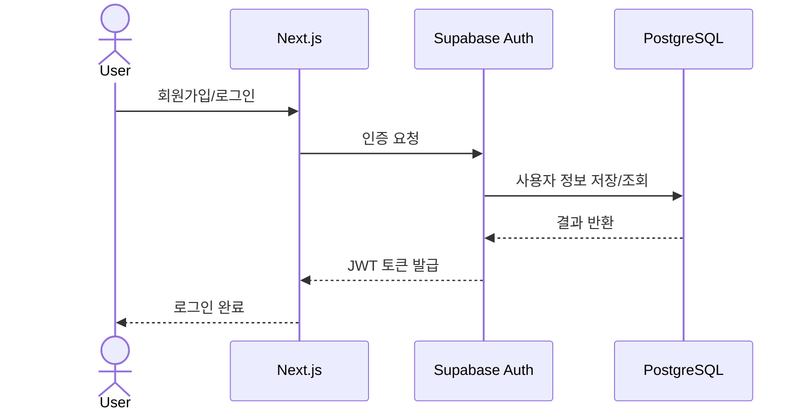
```mermaid
sequenceDiagram
    actor User
    participant Web as Next.js
    participant Auth as Supabase Auth
    participant DB as PostgreSQL

    User->>Web: 회원가입/로그인
    Web->>Auth: 인증 요청
    Auth->>DB: 사용자 정보 저장/조회
    DB-->>Auth: 결과 반환
    Auth-->>Web: JWT 토큰 발급
    Web-->>User: 로그인 완료
```

---

### 2. 엑셀 파일 업로드 및 분류 플로우

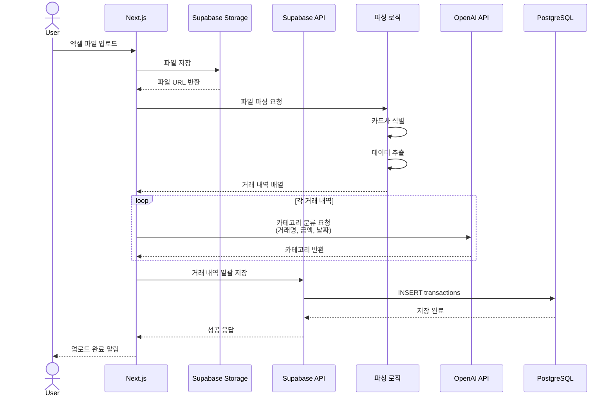
```mermaid
sequenceDiagram
    actor User
    participant Web as Next.js
    participant Storage as Supabase Storage
    participant API as Supabase API
    participant Parser as 파싱 로직
    participant AI as OpenAI API
    participant DB as PostgreSQL

    User->>Web: 엑셀 파일 업로드
    Web->>Storage: 파일 저장
    Storage-->>Web: 파일 URL 반환
    
    Web->>Parser: 파일 파싱 요청
    Parser->>Parser: 카드사 식별
    Parser->>Parser: 데이터 추출
    Parser-->>Web: 거래 내역 배열
    
    loop 각 거래 내역
        Web->>AI: 카테고리 분류 요청<br/>(거래명, 금액, 날짜)
        AI-->>Web: 카테고리 반환
    end
    
    Web->>API: 거래 내역 일괄 저장
    API->>DB: INSERT transactions
    DB-->>API: 저장 완료
    API-->>Web: 성공 응답
    Web-->>User: 업로드 완료 알림
```

---

### 3. 거래 내역 조회 및 통계 플로우

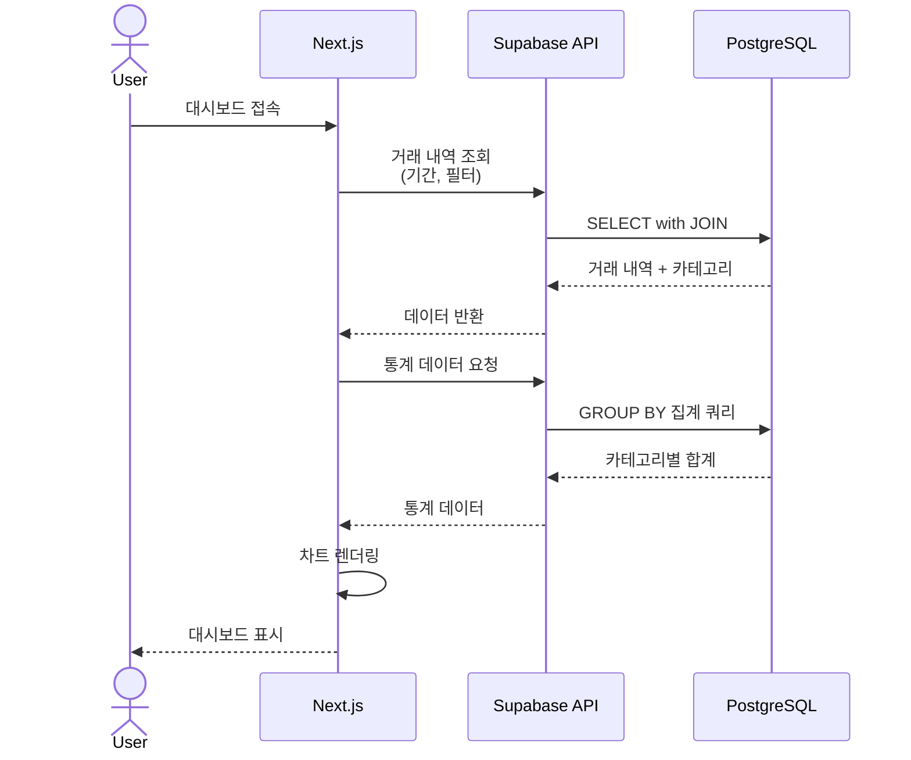
```mermaid
sequenceDiagram
    actor User
    participant Web as Next.js
    participant API as Supabase API
    participant DB as PostgreSQL

    User->>Web: 대시보드 접속
    
    Web->>API: 거래 내역 조회<br/>(기간, 필터)
    API->>DB: SELECT with JOIN
    DB-->>API: 거래 내역 + 카테고리
    API-->>Web: 데이터 반환
    
    Web->>API: 통계 데이터 요청
    API->>DB: GROUP BY 집계 쿼리
    DB-->>API: 카테고리별 합계
    API-->>Web: 통계 데이터
    
    Web->>Web: 차트 렌더링
    Web-->>User: 대시보드 표시
```

---

### 4. 카테고리 수정 및 학습 플로우

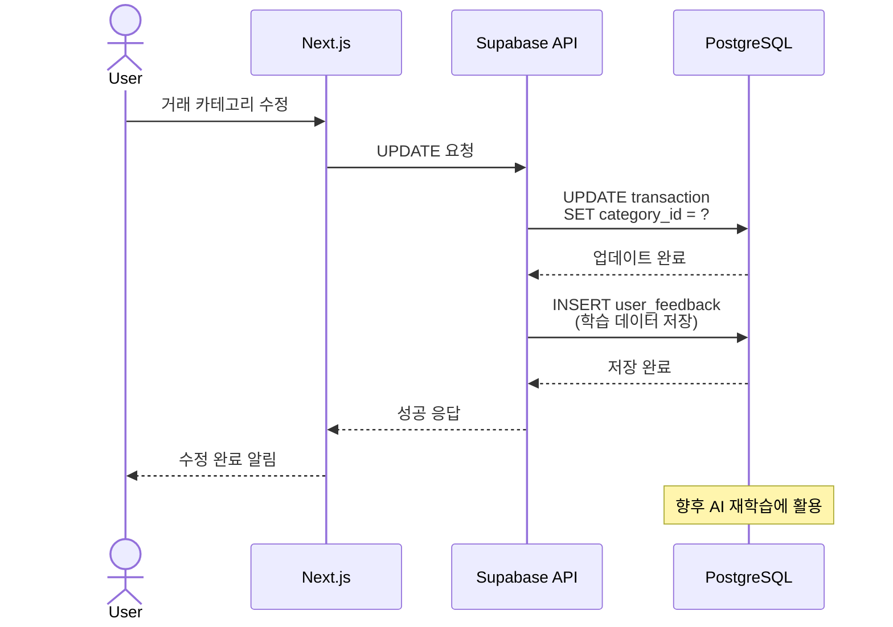
```mermaid
sequenceDiagram
    actor User
    participant Web as Next.js
    participant API as Supabase API
    participant DB as PostgreSQL

    User->>Web: 거래 카테고리 수정
    Web->>API: UPDATE 요청
    API->>DB: UPDATE transaction<br/>SET category_id = ?
    DB-->>API: 업데이트 완료
    
    API->>DB: INSERT user_feedback<br/>(학습 데이터 저장)
    DB-->>API: 저장 완료
    
    API-->>Web: 성공 응답
    Web-->>User: 수정 완료 알림
    
    Note over DB: 향후 AI 재학습에 활용
```

---

## 데이터 흐름도

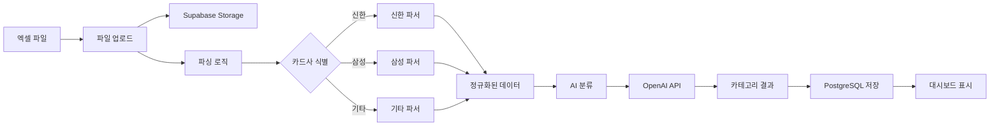
```mermaid
flowchart LR
    A[엑셀 파일] --> B[파일 업로드]
    B --> C[Supabase Storage]
    B --> D[파싱 로직]
    
    D --> E{카드사 식별}
    E -->|신한| F[신한 파서]
    E -->|삼성| G[삼성 파서]
    E -->|기타| H[기타 파서]
    
    F --> I[정규화된 데이터]
    G --> I
    H --> I
    
    I --> J[AI 분류]
    J --> K[OpenAI API]
    K --> L[카테고리 결과]
    
    L --> M[PostgreSQL 저장]
    M --> N[대시보드 표시]
```

---

## 시스템 컴포넌트 구조

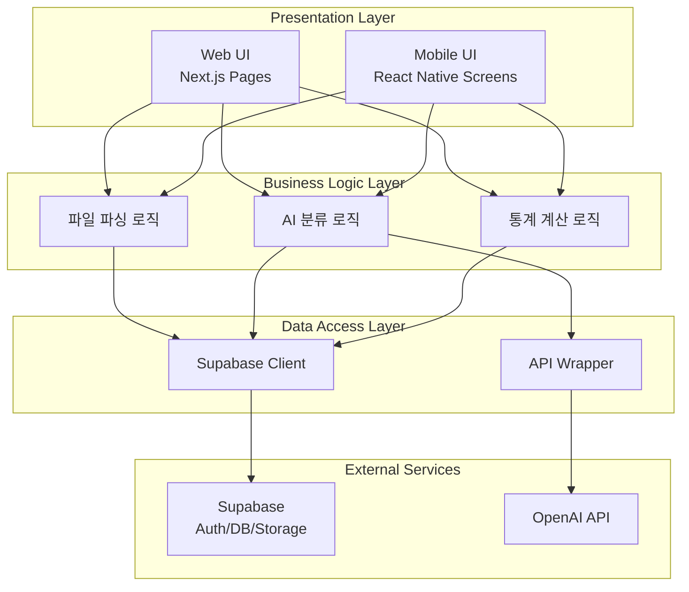
```mermaid
graph TB
    subgraph "Presentation Layer"
        A1[Web UI<br/>Next.js Pages]
        A2[Mobile UI<br/>React Native Screens]
    end
    
    subgraph "Business Logic Layer"
        B1[파일 파싱 로직]
        B2[AI 분류 로직]
        B3[통계 계산 로직]
    end
    
    subgraph "Data Access Layer"
        C1[Supabase Client]
        C2[API Wrapper]
    end
    
    subgraph "External Services"
        D1[Supabase<br/>Auth/DB/Storage]
        D2[OpenAI API]
    end
    
    A1 --> B1
    A1 --> B2
    A1 --> B3
    A2 --> B1
    A2 --> B2
    A2 --> B3
    
    B1 --> C1
    B2 --> C1
    B2 --> C2
    B3 --> C1
    
    C1 --> D1
    C2 --> D2
```

---

## 배포 아키텍처

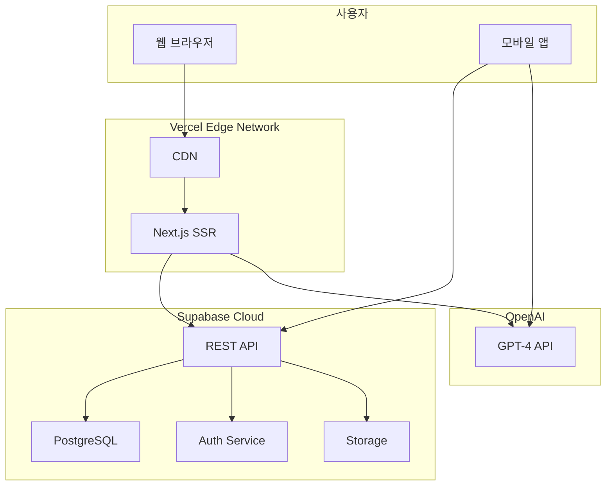
```mermaid
graph TB
    subgraph "사용자"
        U1[웹 브라우저]
        U2[모바일 앱]
    end
    
    subgraph "Vercel Edge Network"
        V1[CDN]
        V2[Next.js SSR]
    end
    
    subgraph "Supabase Cloud"
        S1[PostgreSQL]
        S2[Auth Service]
        S3[Storage]
        S4[REST API]
    end
    
    subgraph "OpenAI"
        O1[GPT-4 API]
    end
    
    U1 --> V1
    U2 --> S4
    V1 --> V2
    V2 --> S4
    S4 --> S1
    S4 --> S2
    S4 --> S3
    V2 --> O1
    U2 --> O1
```

---

## AI 분류 프로세스 상세

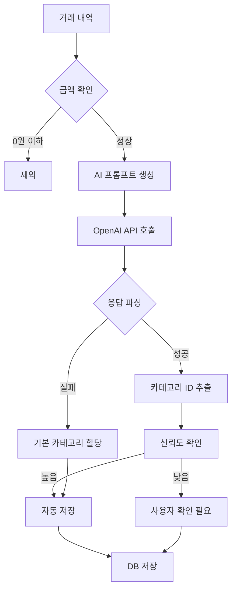
```mermaid
flowchart TD
    A[거래 내역] --> B{금액 확인}
    B -->|0원 이하| C[제외]
    B -->|정상| D[AI 프롬프트 생성]
    
    D --> E[OpenAI API 호출]
    E --> F{응답 파싱}
    
    F -->|성공| G[카테고리 ID 추출]
    F -->|실패| H[기본 카테고리 할당]
    
    G --> I[신뢰도 확인]
    I -->|높음| J[자동 저장]
    I -->|낮음| K[사용자 확인 필요]
    
    H --> J
    J --> L[DB 저장]
    K --> L
```

---

## 에러 처리 플로우

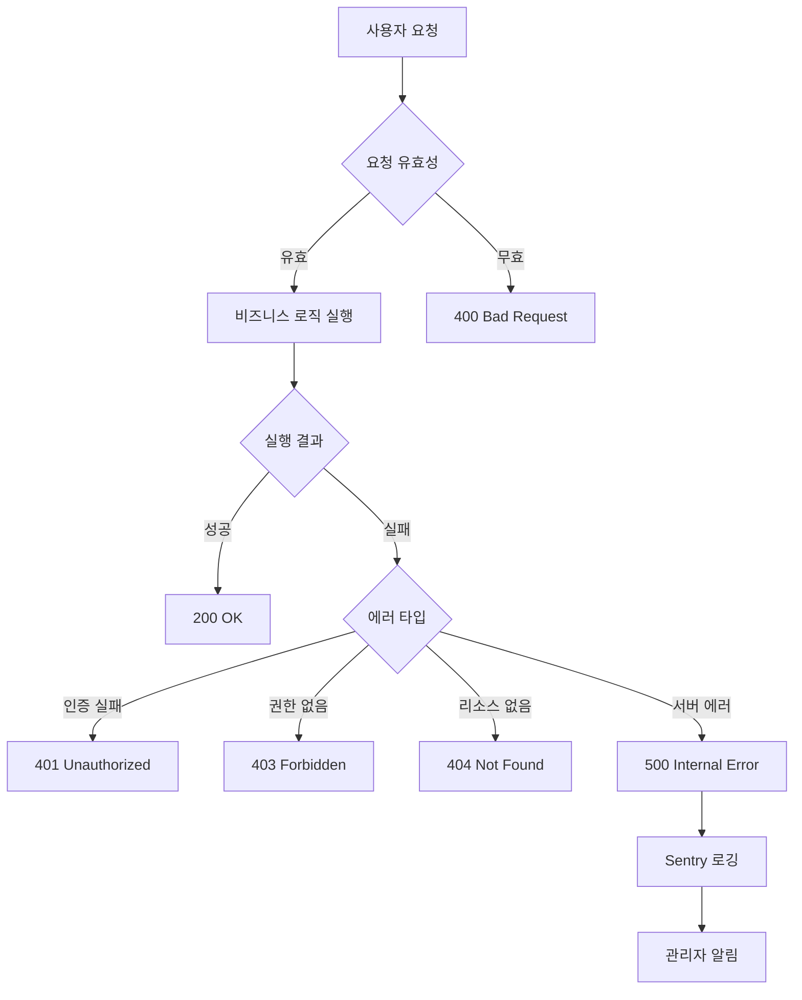
```mermaid
flowchart TD
    A[사용자 요청] --> B{요청 유효성}
    B -->|유효| C[비즈니스 로직 실행]
    B -->|무효| D[400 Bad Request]
    
    C --> E{실행 결과}
    E -->|성공| F[200 OK]
    E -->|실패| G{에러 타입}
    
    G -->|인증 실패| H[401 Unauthorized]
    G -->|권한 없음| I[403 Forbidden]
    G -->|리소스 없음| J[404 Not Found]
    G -->|서버 에러| K[500 Internal Error]
    
    K --> L[Sentry 로깅]
    L --> M[관리자 알림]
```

---

## 보안 플로우

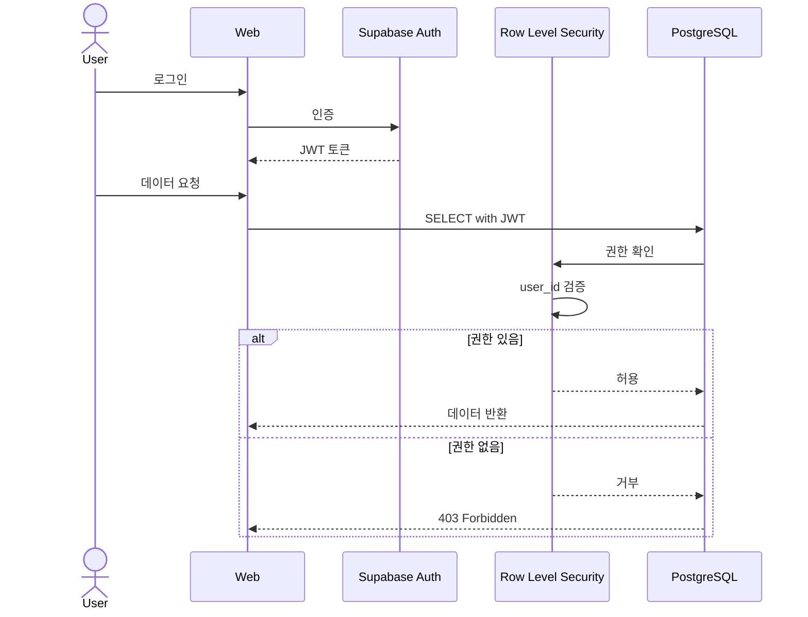
```mermaid
sequenceDiagram
    actor User
    participant Web
    participant Auth as Supabase Auth
    participant RLS as Row Level Security
    participant DB as PostgreSQL

    User->>Web: 로그인
    Web->>Auth: 인증
    Auth-->>Web: JWT 토큰
    
    User->>Web: 데이터 요청
    Web->>DB: SELECT with JWT
    DB->>RLS: 권한 확인
    RLS->>RLS: user_id 검증
    
    alt 권한 있음
        RLS-->>DB: 허용
        DB-->>Web: 데이터 반환
    else 권한 없음
        RLS-->>DB: 거부
        DB-->>Web: 403 Forbidden
    end
```

---

## 성능 최적화 전략

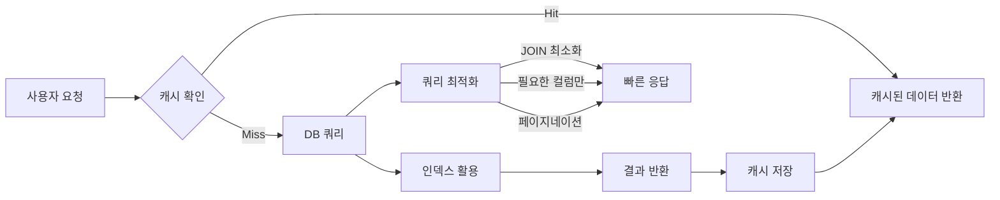
```mermaid
graph LR
    A[사용자 요청] --> B{캐시 확인}
    B -->|Hit| C[캐시된 데이터 반환]
    B -->|Miss| D[DB 쿼리]
    
    D --> E[인덱스 활용]
    E --> F[결과 반환]
    F --> G[캐시 저장]
    G --> C
    
    D --> H[쿼리 최적화]
    H -->|JOIN 최소화| I
    H -->|필요한 컬럼만| I
    H -->|페이지네이션| I[빠른 응답]
```

---

## 향후 확장 계획

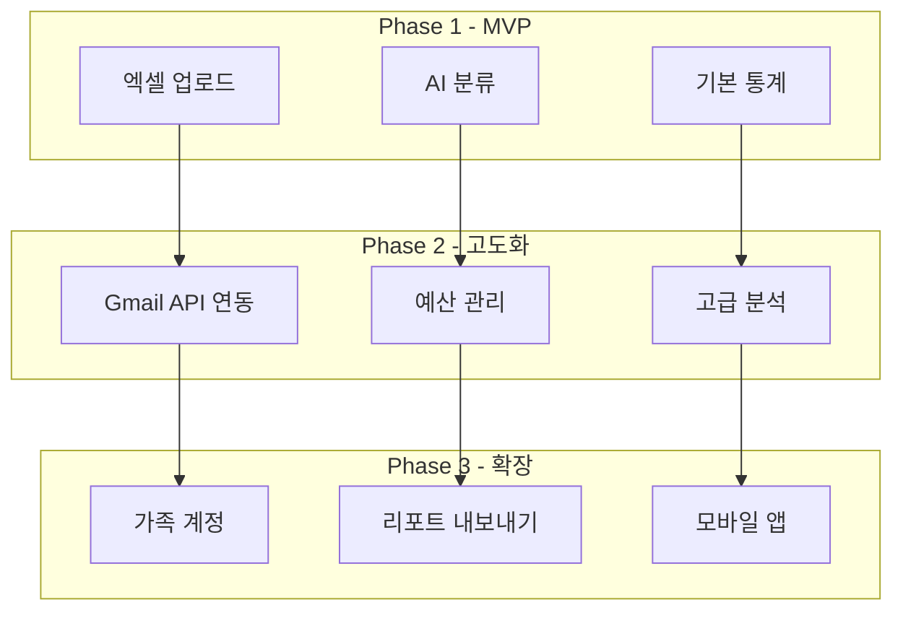
```mermaid
graph TB
    subgraph "Phase 1 - MVP"
        P1[엑셀 업로드]
        P2[AI 분류]
        P3[기본 통계]
    end
    
    subgraph "Phase 2 - 고도화"
        P4[Gmail API 연동]
        P5[예산 관리]
        P6[고급 분석]
    end
    
    subgraph "Phase 3 - 확장"
        P7[가족 계정]
        P8[리포트 내보내기]
        P9[모바일 앱]
    end
    
    P1 --> P4
    P2 --> P5
    P3 --> P6
    P4 --> P7
    P5 --> P8
    P6 --> P9
```
